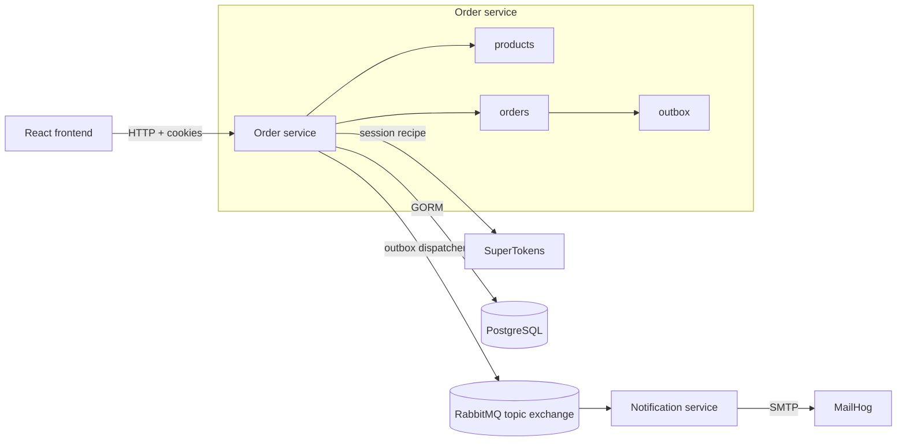

# Coffee Service

Portfolio-grade coffee ordering system built with Go service boundaries, a React frontend, PostgreSQL, RabbitMQ events, SuperTokens auth, and a notification worker.

The project intentionally keeps products inside the order-service for the current demo while preserving a clean split between HTTP handlers, business services, models, shared auth, shared events, and the notification consumer. Future gateway, product-service, and Authentik/JWKS work is documented as architecture direction rather than shipped scope.

## Features

- Retro/pixel React ordering console with menu browsing, cart checkout, customer order history, and staff queue views.
- SuperTokens email/password auth mounted at `/auth`, including `/auth/me` and role-aware middleware.
- Guest, user, barista, and admin flows with role-specific rate limits.
- Product CRUD and seeded coffee menu owned by the order-service.
- Checkout with server-side product lookup so clients never submit trusted prices.
- Customer order history and barista/admin operational queue.
- Status workflow: `preparing -> ready -> completed`, with cancellation from active states.
- Transactional outbox for `order.created` and `order.status_updated`.
- RabbitMQ topic exchange for order facts.
- Notification service that consumes order events and sends SMTP email, with MailHog for local capture.
- PostgreSQL runtime persistence and SQLite-backed isolated service tests.

## System Chart



Detailed charts and reference docs:

- [Architecture](docs/architecture.md)
- [API Reference](docs/api.md)
- [Event Contracts](docs/events.md)
- [Operations Runbook](docs/runbook.md)

## Stack

- Go, Gin, GORM
- React, Vite
- PostgreSQL for local runtime data
- SQLite for tests
- RabbitMQ topic exchange for order events
- SuperTokens for current auth/session handling
- MailHog for local notification email capture
- Docker Compose for local infrastructure

## Running Locally

Start the full stack:

```bash
docker compose up --build
```

Default local endpoints:

| Component | URL |
| --- | --- |
| Frontend | `http://localhost` |
| Order API | `http://localhost:8080` |
| Health check | `http://localhost:8080/ping` |
| SuperTokens | `http://localhost:3567` |
| RabbitMQ management | `http://localhost:15672` |
| MailHog UI | `http://localhost:8025` |

Default role emails:

| Role | Email |
| --- | --- |
| Admin | `admin@example.com` |
| Barista | `barista@example.com` |
| User | Any other signed-up email |
| Guest | Anonymous requests that pass guest rate limits |

Stop the stack:

```bash
docker compose down
```

Remove local runtime data:

```bash
docker compose down -v
```

## Demo Flow

1. Open `http://localhost` and browse the seeded menu as a guest.
2. Add one or more products to the cart and place an order with a receipt email.
3. Open `http://localhost:8025` to inspect the order-created email in MailHog.
4. Sign up as `barista@example.com` to open the barista queue.
5. Move the order through `READY` and `COMPLETE`.
6. Recheck MailHog for status-update emails.
7. Sign up as `admin@example.com` to use admin-only product management API routes.

## API Overview

Products:

| Method | Path | Roles | Description |
| --- | --- | --- | --- |
| `GET` | `/products` | guest, user, admin | List menu products |
| `GET` | `/products/:id` | guest, user, admin | Get one product |
| `POST` | `/products` | admin | Create a product |
| `PUT` | `/products/:id` | admin | Update a product |
| `DELETE` | `/products/:id` | admin | Delete a product |

Orders:

| Method | Path | Roles | Description |
| --- | --- | --- | --- |
| `POST` | `/orders` | guest, user, admin | Create an order from product IDs and quantities |
| `GET` | `/orders/mine` | guest, user, admin | List customer orders |
| `GET` | `/orders` | barista, admin | List all orders |
| `GET` | `/orders/:id` | barista, admin | Get one order |
| `POST` | `/orders/:id/ready` | barista, admin | Mark a preparing order ready |
| `POST` | `/orders/:id/complete` | barista, admin | Mark a ready order completed |
| `POST` | `/orders/:id/cancel` | barista, admin | Cancel a preparing or ready order |
| `DELETE` | `/orders/:id` | admin | Delete an order |

Auth routes are mounted under `/auth` by SuperTokens. See [API Reference](docs/api.md) for request and response examples.

## Events

Order events are published to the durable RabbitMQ topic exchange `coffee.orders`:

- `order.created`
- `order.status_updated`

Events are written to the order-service outbox inside the same database transaction as the order change, then dispatched by a background worker. The notification service binds `notification-service.orders` to both routing keys and treats events as facts, not commands.

See [Event Contracts](docs/events.md) for payloads and idempotency notes.

## Tests and Checks

Run the full local check suite:

```bash
make check
```

This runs Go tests for all modules, builds the frontend, and validates Docker Compose configuration.

Run targeted checks:

```bash
make test
make frontend-build
make docker-config
```

## Architecture Notes

- Current auth is SuperTokens inside order-service.
- Current product data lives in order-service for demo simplicity.
- The future gateway will validate JWTs and inject trusted user headers.
- The future product service will own products and expose product lookup to order-service.
- Swagger is intentionally not wired right now because the Markdown API reference is smaller, current, and sufficient for the portfolio demo.
