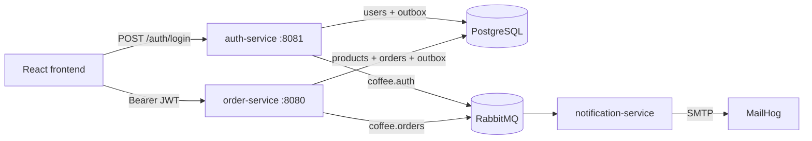

# Coffee Service

Coffee Service is a portfolio-style coffee ordering demo with a React frontend, dedicated Go auth and order APIs, RabbitMQ event delivery, PostgreSQL persistence, and a Go notification worker.

The application now has **3 application services**:

| Service | Role |
| --- | --- |
| `auth-service` | Owns email/password login, JWT issuance, user roles, and auth-domain events. |
| `order-service` | Owns products, checkout, order workflow, and order outbox publishing. |
| `notification-service` | Consumes order/auth facts from RabbitMQ and sends notification emails through SMTP/MailHog. |

## Features

- Retro/pixel React ordering console.
- Email/password auth with JWT bearer sessions.
- Roles: `user`, `barista`, `admin`.
- Seeded coffee menu and cart checkout.
- User order history and barista queue actions.
- PostgreSQL runtime data and SQLite-backed service tests.
- Transactional outbox publishing for order and auth events.
- MailHog-backed local email inspection.

## System Chart



## Running Locally

```bash
docker compose up --build
```

Default local endpoints:

| Component | URL |
| --- | --- |
| Frontend | `http://localhost` |
| Auth API | `http://localhost:8081` |
| Order API | `http://localhost:8080` |
| RabbitMQ management | `http://localhost:15672` |
| MailHog UI | `http://localhost:8025` |

Reset local data:

```bash
docker compose down -v
```

## Demo Accounts

| Role | Email | Password |
| --- | --- | --- |
| `user` | `customer@example.com` | `customer123` |
| `barista` | `barista@coffee.local` | `barista123` |
| `admin` | `admin@coffee.local` | `admin123` |

## Demo Flow

1. Open `http://localhost`.
2. Sign in with the `user` demo account.
3. Place an order and confirm the order-created email in MailHog.
4. Switch to the `barista` or `admin` account.
5. Open the queue and move the order to `READY`, then `COMPLETE`.
6. Trigger `POST /auth/password-reset-requests` and confirm the auth event email.

## API Overview

The project has **2 HTTP APIs**:

| Service | Base URL | Notes |
| --- | --- | --- |
| `auth-service` | `http://localhost:8081` | Login, token introspection, password reset request creation. |
| `order-service` | `http://localhost:8080` | Products, orders, and barista workflow. |

## Events

RabbitMQ carries two fact streams:

- `coffee.orders`: `order.created`, `order.status_updated`
- `coffee.auth`: `password_reset.requested`

Both auth-service and order-service write outbox rows in the same transaction as the state change they represent. Notification-service consumes those facts and sends emails without writing to another service database.

## Tests

```bash
make check
```

This runs Go tests, builds the frontend, and validates Docker Compose.
