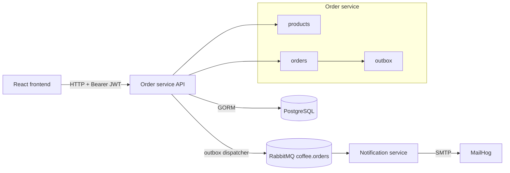

# Coffee Service

Coffee Service is a simplified coffee ordering demo built for an oral project defense. It has a React frontend, one Go HTTP API, RabbitMQ events, PostgreSQL persistence, and a second Go service that consumes events and sends notifications.

The application intentionally has **2 application services**:

| Service | Role |
| --- | --- |
| `order-service` | Owns products, checkout, order status workflow, custom basic-auth login, JWT validation, database writes, and event publishing. |
| `notification-service` | Consumes order events from RabbitMQ and sends order lifecycle emails through SMTP/MailHog. |

Supporting containers are PostgreSQL, RabbitMQ, MailHog, and the frontend Nginx container.

## Features

- Retro/pixel React ordering console.
- Seeded coffee menu and cart checkout.
- Customer order history by email.
- Staff order queue with ready, complete, and cancel actions.
- Custom basic-auth login that issues JWT bearer tokens for customer, staff, and admin demo accounts.
- PostgreSQL runtime data and SQLite service tests.
- RabbitMQ topic exchange for order facts.
- Notification service that receives events and sends email to MailHog.
- GitHub Actions CI/CD for tests, frontend build, Compose validation, and image publishing.

## System Chart



## Running Locally

```bash
docker compose up --build
```

Default local endpoints:

| Component | URL |
| --- | --- |
| Frontend | `http://localhost` |
| Order API | `http://localhost:8080` |
| Health check | `http://localhost:8080/ping` |
| RabbitMQ management | `http://localhost:15672` |
| MailHog UI | `http://localhost:8025` |

Stop the stack:

```bash
docker compose down
```

Reset local data:

```bash
docker compose down -v
```

## Demo Flow

1. Open `http://localhost`.
2. Browse the menu, enter a receipt email, and place an order.
3. Open `http://localhost:8025` and confirm the order-created email.
4. Switch the frontend session to the `Staff` demo account.
5. Open the staff queue and move the order to `READY`, then `COMPLETE`.
6. Recheck MailHog for status-update emails.

## API Overview

The project has **1 HTTP API**: `order-service`.

There are **10 demo endpoints**:

| Method | Path | Role | Description |
| --- | --- | --- | --- |
| `GET` | `/ping` | public | Health check. |
| `POST` | `/auth/login` | public | Exchanges HTTP Basic credentials for a JWT. |
| `GET` | `/auth/me` | authenticated | Returns the current JWT subject, email, and role. |
| `GET` | `/products` | customer, staff, admin | List menu products. |
| `POST` | `/orders` | customer, admin | Create an order from product IDs and quantities. |
| `GET` | `/orders/mine?email=:email` | customer, admin | List orders for a customer email. |
| `GET` | `/staff/orders` | staff, admin | List all orders for the staff queue. |
| `POST` | `/staff/orders/:id/ready` | staff, admin | Mark a preparing order ready. |
| `POST` | `/staff/orders/:id/complete` | staff, admin | Mark a ready order completed. |
| `POST` | `/staff/orders/:id/cancel` | staff, admin | Cancel a preparing or ready order. |

Demo auth is intentionally simple:

```text
POST /auth/login
Authorization: Basic base64(email:password)
```

Successful login returns a bearer token. The frontend sends that JWT in `Authorization: Bearer <token>` for API calls.

## Events

Order events are published to the durable RabbitMQ topic exchange `coffee.orders`:

- `order.created`
- `order.status_updated`

The order service writes events to an outbox table in the same database transaction as the order change. A background dispatcher publishes those events to RabbitMQ. The notification service consumes those facts and sends emails.

RabbitMQ is used so checkout does not directly call notification code. If notification delivery is slow or temporarily down, orders can still be saved and events can be retried.

## Tests And CI/CD

Run the full local check suite:

```bash
make check
```

This runs Go tests, builds the frontend, and validates Docker Compose.

CI/CD lives in `.github/workflows/ci-cd.yml`:

- Pull requests and pushes run tests/build checks.
- Pushes to `main` build and publish Docker images to GHCR.
