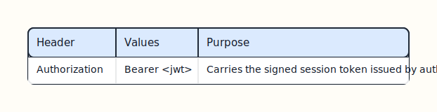
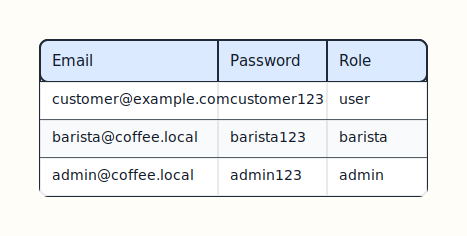
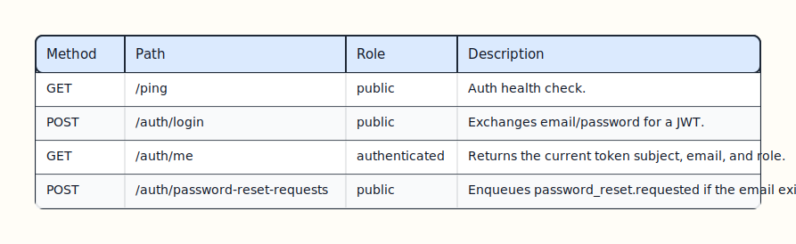
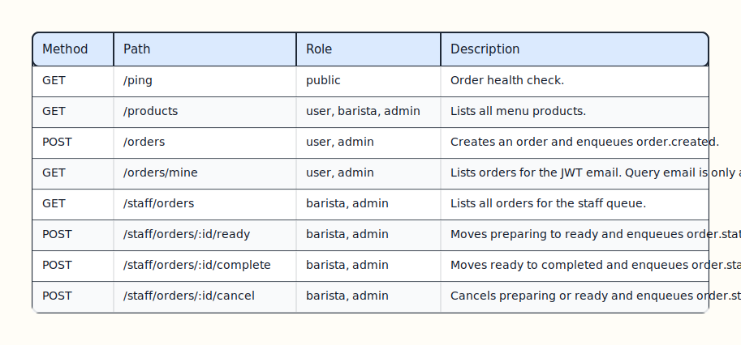
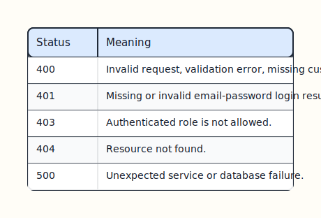

# API Reference

Local Compose API bases:

- Auth API: `http://localhost/auth`
- Order API: `http://localhost/api`

## Authentication

Login is handled by `auth-service` with JSON email/password input.

```http
POST /auth/login
Content-Type: application/json

{
  "email": "customer@example.com",
  "password": "customer123"
}
```

Authenticated application routes use:



[Edit Excalidraw source](diagrams/api-auth-header.excalidraw)

Default local demo accounts:



[Edit Excalidraw source](diagrams/api-demo-accounts.excalidraw)

## Auth Endpoints



[Edit Excalidraw source](diagrams/api-auth-endpoints.excalidraw)

Login response:

```json
{
  "access_token": "<jwt>",
  "token_type": "Bearer",
  "expires_at": "2026-05-15T18:00:00Z",
  "user": {
    "id": "6f1ac76e-f1d3-45f0-a4da-f123456789ab",
    "email": "customer@example.com",
    "role": "user"
  }
}
```

Password reset request:

```json
{
  "email": "customer@example.com"
}
```

## Order Endpoints



[Edit Excalidraw source](diagrams/api-order-endpoints.excalidraw)

## Products

Product response:

```json
{
  "id": "0c94a67d-a6cb-4429-bf31-97f5fa8f673f",
  "name": "Caffe Latte",
  "category": "hot",
  "price_in_kurus": 8500,
  "image_path": "/products/latte.png",
  "available": true
}
```

## Orders

Create request:

```json
{
  "customer_email": "customer@example.com",
  "items": [
    {
      "product_id": "0c94a67d-a6cb-4429-bf31-97f5fa8f673f",
      "quantity": 2
    }
  ]
}
```

`customer_email` may be omitted when the bearer token already carries the user email. Prices and product names are loaded server-side from stored product records, so the client sends only product IDs and quantities.

Order response:

```json
{
  "id": "711f2c78-bb2b-4192-b1ab-f69dc4b92775",
  "customer_email": "customer@example.com",
  "items": [
    {
      "product_id": "0c94a67d-a6cb-4429-bf31-97f5fa8f673f",
      "product_name": "Caffe Latte",
      "quantity": 2,
      "price_in_kurus": 8500
    }
  ],
  "total": 17000,
  "status": "preparing",
  "created_at": "2026-05-04T12:00:00Z"
}
```

Valid status transitions:

- `preparing -> ready`
- `ready -> completed`
- `preparing -> cancelled`
- `ready -> cancelled`


[Edit Excalidraw source](diagrams/api-status-transitions.excalidraw)

## Errors

Most errors return:

```json
{
  "error": "invalid_order_status_transition"
}
```

Common status codes:



[Edit Excalidraw source](diagrams/api-errors.excalidraw)
