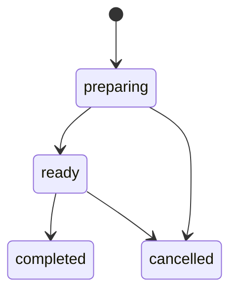

# API Reference

Base URL for local Compose: `http://localhost:8080`.

All protected app routes are mounted under the optional SuperTokens session middleware and role limiter. Guests can use the menu and checkout routes where listed. Signed-in users send SuperTokens cookies automatically from the frontend.

## Health

| Method | Path | Description |
| --- | --- | --- |
| `GET` | `/ping` | Returns `{"message":"pong"}`. |

## Auth

SuperTokens routes are mounted under `/auth`.

| Method | Path | Description |
| --- | --- | --- |
| `POST` | `/auth/signup` | SuperTokens email/password signup. |
| `POST` | `/auth/signin` | SuperTokens email/password login. |
| `POST` | `/auth/signout` | Ends the current session. |
| `POST` | `/auth/session/refresh` | Refreshes an expired access token. |
| `GET` | `/auth/me` | Returns current user claims. |

`/auth/me` response:

```json
{
  "subject": "supertokens-user-id",
  "email": "barista@example.com",
  "role": "barista"
}
```

## Roles

| Role | Source | Access summary |
| --- | --- | --- |
| `guest` | No active session | List products, create orders, query own orders by email. |
| `user` | Signed in, not in staff email lists | Customer order workflow. |
| `barista` | Email in `SUPERTOKENS_BARISTA_EMAILS` | Staff queue and status updates. |
| `admin` | Email in `SUPERTOKENS_ADMIN_EMAILS` | Product management plus staff queue. |

## Products

Product response:

```json
{
  "id": "0c94a67d-a6cb-4429-bf31-97f5fa8f673f",
  "name": "Caffe Latte",
  "category": "hot",
  "price_in_kurus": 8500,
  "image_path": "/products/latte.png",
  "available": true
}
```

Create or update request:

```json
{
  "name": "Iced Latte",
  "category": "cold",
  "price_in_kurus": 9000,
  "image_path": "/products/iced-latte.png",
  "available": true
}
```

| Method | Path | Roles | Description |
| --- | --- | --- | --- |
| `GET` | `/products` | guest, user, admin | Lists all products. |
| `GET` | `/products/:id` | guest, user, admin | Returns one product by UUID. |
| `POST` | `/products` | admin | Creates a product. |
| `PUT` | `/products/:id` | admin | Replaces product fields. |
| `DELETE` | `/products/:id` | admin | Deletes a product. |

Validation:

- `name` is required.
- `category` must be `hot` or `cold`.
- `price_in_kurus` must be zero or greater.
- `image_path` is required.

## Orders

Create request:

```json
{
  "customer_email": "customer@example.com",
  "items": [
    {
      "product_id": "0c94a67d-a6cb-4429-bf31-97f5fa8f673f",
      "quantity": 2
    }
  ]
}
```

Signed-in users may omit `customer_email`; the service uses the email from session claims. Prices and product names are loaded server-side from current product records.

Order response:

```json
{
  "id": "711f2c78-bb2b-4192-b1ab-f69dc4b92775",
  "customer_email": "customer@example.com",
  "items": [
    {
      "product_id": "0c94a67d-a6cb-4429-bf31-97f5fa8f673f",
      "product_name": "Caffe Latte",
      "quantity": 2,
      "price_in_kurus": 8500
    }
  ],
  "total": 17000,
  "status": "preparing",
  "created_at": "2026-05-04T12:00:00Z"
}
```

| Method | Path | Roles | Description |
| --- | --- | --- | --- |
| `POST` | `/orders` | guest, user, admin | Creates an order and enqueues `order.created`. |
| `GET` | `/orders/mine?email=:email` | guest, user, admin | Lists matching customer orders. Signed-in users always use their session email. |
| `GET` | `/orders` | barista, admin | Lists all orders for staff queue. |
| `GET` | `/orders/:id` | barista, admin | Returns one order by UUID. |
| `POST` | `/orders/:id/ready` | barista, admin | Moves `preparing` to `ready`. |
| `POST` | `/orders/:id/complete` | barista, admin | Moves `ready` to `completed`. |
| `POST` | `/orders/:id/cancel` | barista, admin | Cancels `preparing` or `ready`. |
| `DELETE` | `/orders/:id` | admin | Deletes an order and line items. |

Status transitions:



## Error Shape

Most application errors return a simple JSON object:

```json
{
  "error": "invalid_order_status_transition"
}
```

Common status codes:

| Status | Meaning |
| --- | --- |
| `400` | Invalid request, validation error, missing customer email, invalid transition, or unknown product during checkout. |
| `401` | Authentication required for a route that did not receive claims. |
| `403` | Authenticated role is not allowed. |
| `404` | Resource not found. |
| `429` | Role-based rate limit exceeded. |
| `500` | Unexpected service/database failure. |
