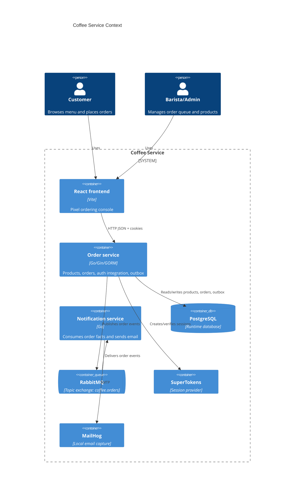
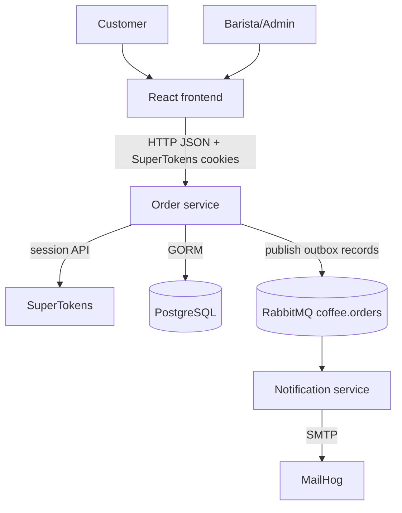
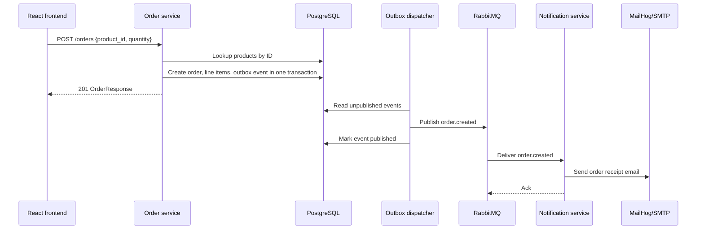
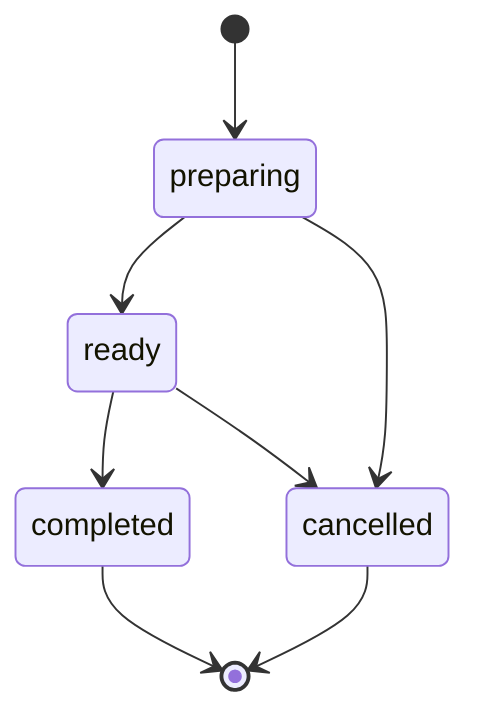

# Architecture

Coffee Service is a compact service-oriented demo. It keeps the runtime small enough to run locally with Docker Compose while showing clean service boundaries, role-aware workflows, and minimal event-driven integration.

## Context Chart

If a Markdown renderer does not support C4 Mermaid syntax, use this equivalent flowchart:

## Runtime Containers

| Container | Purpose |
| --- | --- |
| `frontend` | Serves the Vite-built React console through Nginx. |
| `order-service` | Owns current product/menu data, order checkout, order status workflow, auth routes, role middleware, and outbox dispatch. |
| `notification-service` | Consumes order events and sends order lifecycle emails. It does not write to another service database. |
| `postgres` | Primary runtime database for order-service and SuperTokens metadata. |
| `rabbitmq` | Topic exchange transport for order events. |
| `supertokens` | Current session/auth provider. |
| `mailhog` | Local SMTP sink and email inspection UI. |

## Service Boundaries

The current order-service owns products and orders because this keeps the demo focused and runnable. The boundary is still explicit:

- `internal/models`: GORM models and validation.
- `internal/services`: business behavior and transactions.
- `internal/handlers`: HTTP request/response layer.
- `shared/auth`: SuperTokens setup, role claims, CORS, and rate limiting.
- `shared/events`: event names and JSON payload contracts.
- `shared/rabbitmq`: exchange declaration and publishing helpers.

The notification service consumes events only. It sends email through an injected sender and keeps consumer idempotency local to the process.

## Checkout Sequence

## Order State Machine

Invalid transitions are rejected by `OrderService.UpdateStatus`.

## Auth And Roles

Current authentication is handled in order-service through SuperTokens:

- Auth routes live under `/auth`.
- Optional session middleware assigns a guest claim when no session exists.
- Signed-in users receive `user`, `barista`, or `admin` based on configured email lists.
- API handlers apply explicit role guards.

Future direction:

- Gateway validates Authentik-issued JWTs with JWKS.
- Gateway injects trusted identity headers such as `X-User-Sub` and `X-User-Email`.
- Downstream services trust only the gateway network path.

## Data Ownership

| Data | Current owner | Notes |
| --- | --- | --- |
| Products | Order service | Kept local for demo simplicity and server-side price lookup. |
| Orders | Order service | Includes line items and status lifecycle. |
| Outbox events | Order service | Published asynchronously to RabbitMQ. |
| Notification deliveries | Notification service process | No cross-service database writes. |
| Sessions/users | SuperTokens | Role claim is set from configured email lists. |

## Intentional Non-Goals

- No repository/interface layer until a real alternative storage or mock boundary is needed.
- No standalone product service until the split adds demonstrable value.
- No gateway until the Authentik/JWKS path is implemented.
- No extra event types unless another service consumes the fact.
