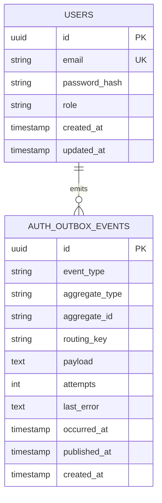
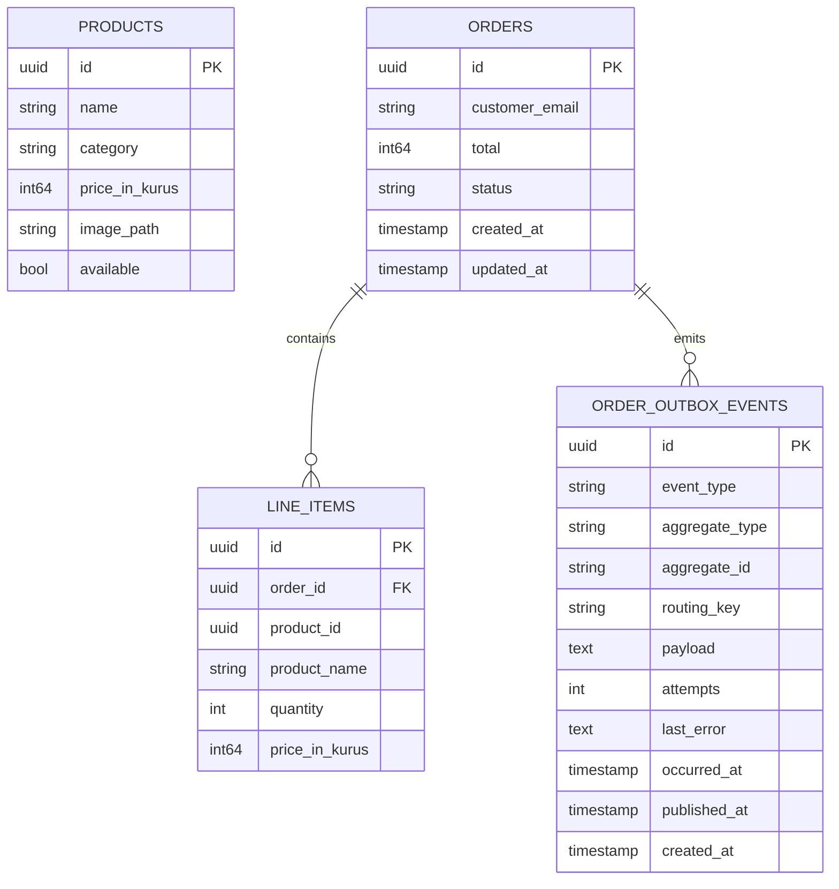

# Architecture

Coffee Service is a compact service-oriented demo with a frontend, two HTTP APIs, RabbitMQ, and an event-only notification worker.

## Runtime Containers

| Container | Purpose |
| --- | --- |
| `frontend` | Serves the Vite-built React console through Nginx. |
| `auth-service` | Owns users, password hashes, JWT issuance, role identity, and auth outbox events. |
| `order-service` | Owns products, orders, checkout, status workflow, and order outbox events. |
| `notification-service` | Consumes order/auth facts and sends emails. It does not write to another service database. |
| `postgres` | Shared PostgreSQL instance with service-owned tables. |
| `rabbitmq` | Topic exchange transport for service facts. |
| `mailhog` | Local SMTP sink and email inspection UI. |

## Service Boundaries

- `auth-service`: email/password auth and roles (`user`, `barista`, `admin`).
- `order-service`: products, orders, and barista workflow.
- `notification-service`: event consumer only.

Shared packages remain intentionally small:

- `shared/auth`: JWT issuing/validation, role parsing, and CORS.
- `shared/events`: event names and payload contracts.
- `shared/rabbitmq`: AMQP helpers.

## Auth And Roles

The frontend logs in through `auth-service`:

```json
{
  "email": "customer@example.com",
  "password": "customer123"
}
```

The auth API returns a JWT. Order-service trusts that token and enforces route access:

- `user`: menu, checkout, own order history.
- `barista`: menu and queue/status actions.
- `admin`: both user and barista capabilities.

## Events

RabbitMQ carries facts between services:

- `coffee.orders`: `order.created`, `order.status_updated`
- `coffee.auth`: `password_reset.requested`

Both producer services use the transactional outbox pattern so database state and publish intent are recorded atomically.

## Database Diagrams

### Auth Service Schema



### Order Service Schema


