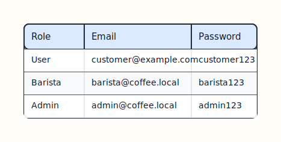
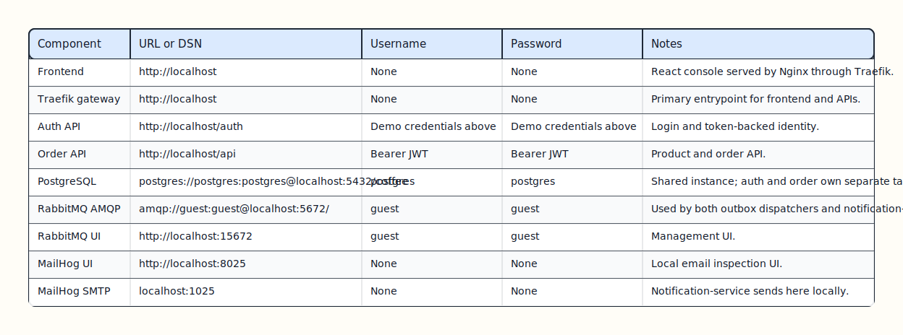
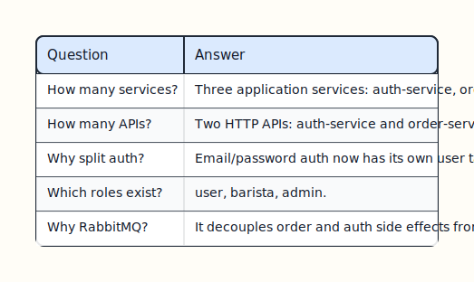

# Credentials And Demo Notes

This page collects local credentials plus short defense-ready answers for the current split-auth architecture.

## Demo Auth

The frontend signs in through `auth-service` with email/password and then stores a bearer JWT.



[Edit Excalidraw source](diagrams/credentials-demo-auth.excalidraw)

Login request:

```json
{
  "email": "customer@example.com",
  "password": "customer123"
}
```

After login, browser requests send:

```text
Authorization: Bearer <token>
```

## Local Infrastructure Credentials



[Edit Excalidraw source](diagrams/credentials-local-infra.excalidraw)

## Quick Defense Answers



[Edit Excalidraw source](diagrams/credentials-defense-answers.excalidraw)

## Database Snapshot

See [architecture.md](architecture.md) for the ER diagrams. The runtime PostgreSQL volume now contains:

- `users` and `outbox_events` owned by `auth-service`
- `products`, `orders`, `line_items`, and order outbox rows owned by `order-service`

## Diagram Pack

### Auth And Access


[Edit Excalidraw source](diagrams/auth-role-sequence.excalidraw)


[Edit Excalidraw source](diagrams/role-resolution.excalidraw)


[Edit Excalidraw source](diagrams/role-access-matrix.excalidraw)

### Frontend And Checkout


[Edit Excalidraw source](diagrams/frontend-workflow.excalidraw)


[Edit Excalidraw source](diagrams/checkout-sequence.excalidraw)

### Events And State


[Edit Excalidraw source](diagrams/outbox-events.excalidraw)


[Edit Excalidraw source](diagrams/order-event-routing.excalidraw)


[Edit Excalidraw source](diagrams/order-state-machine.excalidraw)


[Edit Excalidraw source](diagrams/data-model.excalidraw)

### Future Split


[Edit Excalidraw source](diagrams/future-target-shape.excalidraw)

## Reset Local Data

```bash
docker compose down -v
```

That deletes runtime data for users, products, orders, line items, and outbox rows.
