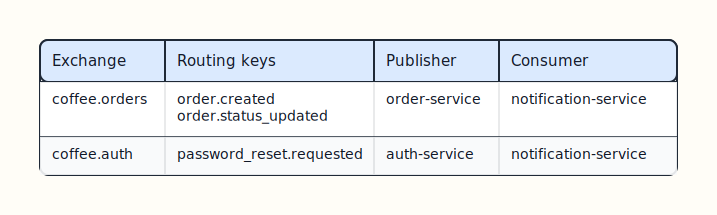
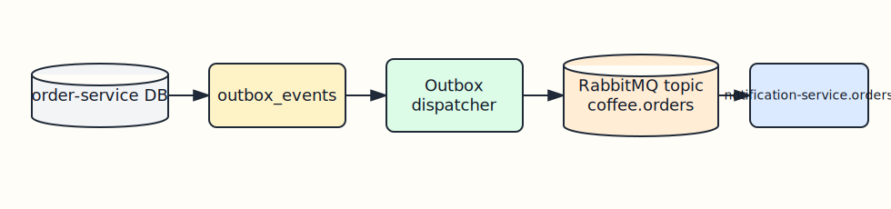
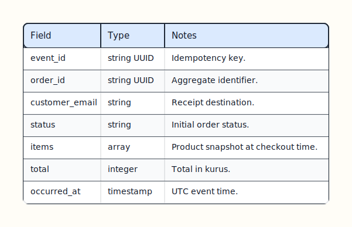
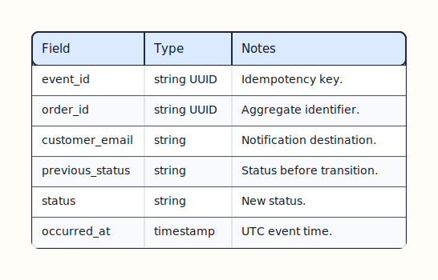
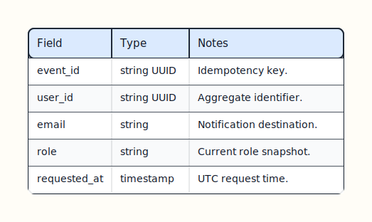

# Event Contracts

Events are facts emitted through transactional outboxes. They are intentionally minimal and stable.

## Transport



[Edit Excalidraw source](diagrams/events-transport-table.excalidraw)

Both exchanges are durable topic exchanges. Notification-service binds one durable queue to the keys it cares about.



[Edit Excalidraw source](diagrams/event-transport.excalidraw)

## Rules

- Events describe completed facts, not commands.
- Event payloads should stay backward compatible.
- Consumers should dedupe by `event_id` where possible.
- Only add an event when another service needs that fact.
- Notification-service must not write to auth-service or order-service tables.

## `order.created`

Published after a new order and its line items are committed.

```json
{
  "event_id": "c08c9d12-8579-42e4-bd29-3fd7b36f97d8",
  "order_id": "711f2c78-bb2b-4192-b1ab-f69dc4b92775",
  "customer_email": "customer@example.com",
  "status": "preparing",
  "items": [
    {
      "product_id": "0c94a67d-a6cb-4429-bf31-97f5fa8f673f",
      "product_name": "Caffe Latte",
      "quantity": 2,
      "price_in_kurus": 8500
    }
  ],
  "total": 17000,
  "occurred_at": "2026-05-04T12:00:00Z"
}
```



[Edit Excalidraw source](diagrams/events-order-created-fields.excalidraw)

## `order.status_updated`

Published after a valid order status transition is committed.

```json
{
  "event_id": "9f49e19b-b1af-48e0-b9a4-8af10ca0d1d2",
  "order_id": "711f2c78-bb2b-4192-b1ab-f69dc4b92775",
  "customer_email": "customer@example.com",
  "previous_status": "preparing",
  "status": "ready",
  "occurred_at": "2026-05-04T12:05:00Z"
}
```



[Edit Excalidraw source](diagrams/events-order-status-updated-fields.excalidraw)

## Outbox Lifecycle


[Edit Excalidraw source](diagrams/outbox-lifecycle.excalidraw)

The dispatcher can safely retry unpublished rows. Consumers should still handle duplicate delivery because RabbitMQ delivery is at-least-once.

## Notification Handling


[Edit Excalidraw source](diagrams/notification-flow.excalidraw)

`notification-service` currently keeps processed event IDs in memory for duplicate suppression during a process lifetime. Delivery is still treated as at-least-once across restarts and reconnects.

## `password_reset.requested`

Published after `auth-service` accepts a password reset request for a known user.

```json
{
  "event_id": "7f49e19b-b1af-48e0-b9a4-8af10ca0d1d2",
  "user_id": "6f1ac76e-f1d3-45f0-a4da-f123456789ab",
  "email": "customer@example.com",
  "role": "user",
  "requested_at": "2026-05-15T12:05:00Z"
}
```



[Edit Excalidraw source](diagrams/events-password-reset-fields.excalidraw)
