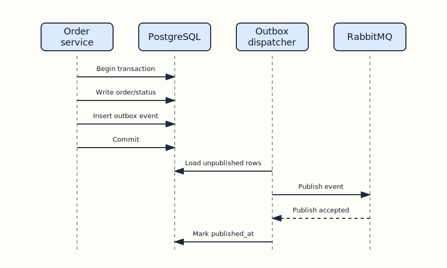

# Event Contracts

Events are facts emitted through transactional outboxes. They are intentionally minimal and stable.

## Transport

| Exchange | Routing keys | Publisher | Consumer |
| --- | --- | --- | --- |
| `coffee.orders` | `order.created`, `order.status_updated` | `order-service` | `notification-service` |
| `coffee.auth` | `password_reset.requested` | `auth-service` | `notification-service` |

Both exchanges are durable topic exchanges. Notification-service binds one durable queue to the keys it cares about.

## Rules

- Events describe completed facts, not commands.
- Event payloads should stay backward compatible.
- Consumers should dedupe by `event_id` where possible.
- Only add an event when another service needs that fact.
- Notification-service must not write to auth-service or order-service tables.

## `order.created`

Published after a new order and its line items are committed.

```json
{
  "event_id": "c08c9d12-8579-42e4-bd29-3fd7b36f97d8",
  "order_id": "711f2c78-bb2b-4192-b1ab-f69dc4b92775",
  "customer_email": "customer@example.com",
  "status": "preparing",
  "items": [
    {
      "product_id": "0c94a67d-a6cb-4429-bf31-97f5fa8f673f",
      "product_name": "Caffe Latte",
      "quantity": 2,
      "price_in_kurus": 8500
    }
  ],
  "total": 17000,
  "occurred_at": "2026-05-04T12:00:00Z"
}
```

| Field | Type | Notes |
| --- | --- | --- |
| `event_id` | string UUID | Idempotency key. |
| `order_id` | string UUID | Aggregate identifier. |
| `customer_email` | string | Receipt destination. |
| `status` | string | Initial order status. |
| `items` | array | Product snapshot at checkout time. |
| `total` | integer | Total in kurus. |
| `occurred_at` | timestamp | UTC event time. |

## `order.status_updated`

Published after a valid order status transition is committed.

```json
{
  "event_id": "9f49e19b-b1af-48e0-b9a4-8af10ca0d1d2",
  "order_id": "711f2c78-bb2b-4192-b1ab-f69dc4b92775",
  "customer_email": "customer@example.com",
  "previous_status": "preparing",
  "status": "ready",
  "occurred_at": "2026-05-04T12:05:00Z"
}
```

| Field | Type | Notes |
| --- | --- | --- |
| `event_id` | string UUID | Idempotency key. |
| `order_id` | string UUID | Aggregate identifier. |
| `customer_email` | string | Notification destination. |
| `previous_status` | string | Status before transition. |
| `status` | string | New status. |
| `occurred_at` | timestamp | UTC event time. |

## Outbox Lifecycle



[Edit Excalidraw source](diagrams/outbox-lifecycle.excalidraw)

The dispatcher can safely retry unpublished rows. Consumers should still handle duplicate delivery because RabbitMQ delivery is at-least-once.

## `password_reset.requested`

Published after `auth-service` accepts a password reset request for a known user.

```json
{
  "event_id": "7f49e19b-b1af-48e0-b9a4-8af10ca0d1d2",
  "user_id": "6f1ac76e-f1d3-45f0-a4da-f123456789ab",
  "email": "customer@example.com",
  "role": "user",
  "requested_at": "2026-05-15T12:05:00Z"
}
```

| Field | Type | Notes |
| --- | --- | --- |
| `event_id` | string UUID | Idempotency key. |
| `user_id` | string UUID | Aggregate identifier. |
| `email` | string | Notification destination. |
| `role` | string | Current role snapshot. |
| `requested_at` | timestamp | UTC request time. |
