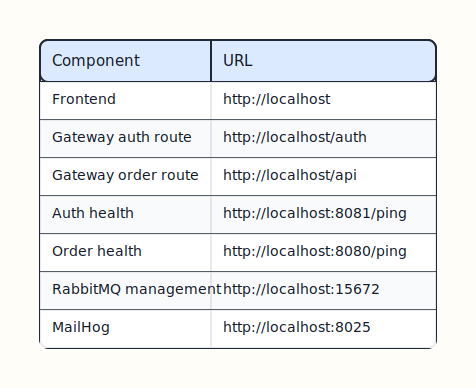
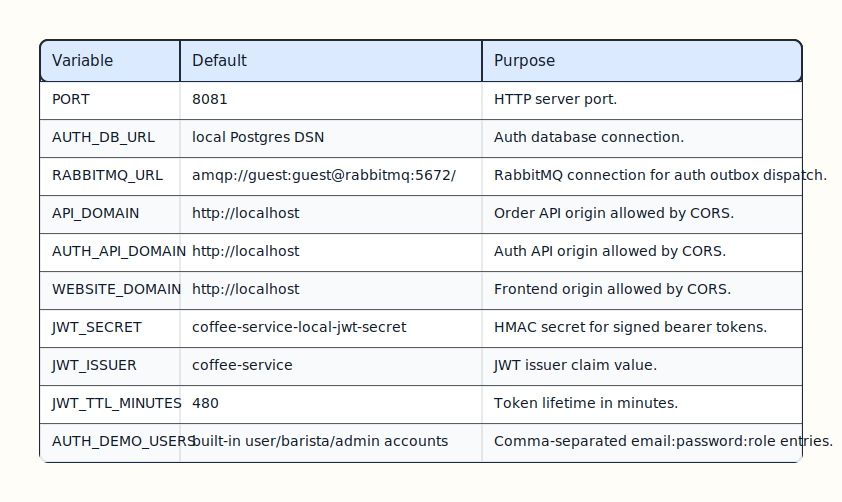
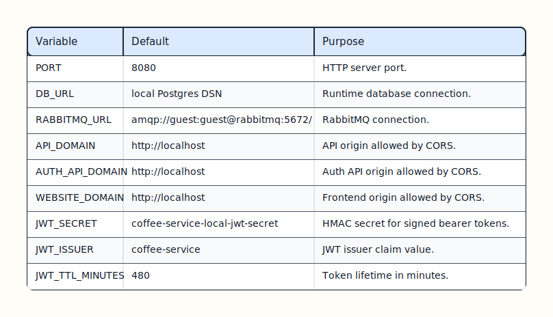
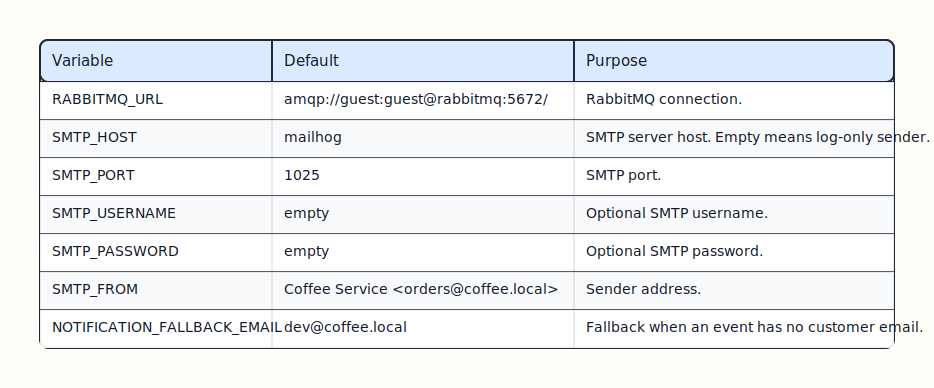
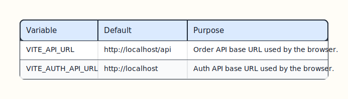
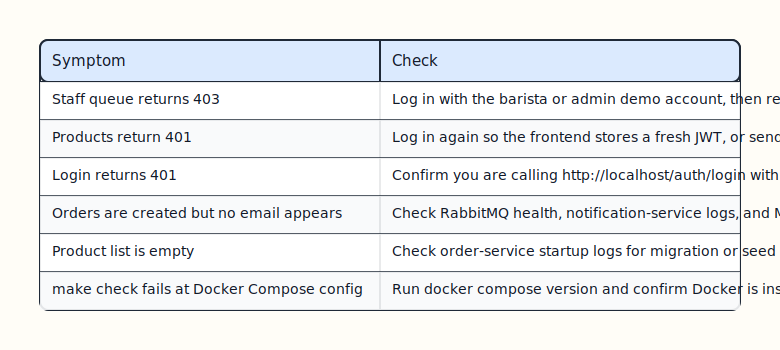

# Operations Runbook

This runbook covers the simplified local demo.

## Start

```bash
docker compose up --build
```

Expected endpoints:



[Edit Excalidraw source](diagrams/runbook-expected-endpoints.excalidraw)

## Smoke Test

```bash
curl http://localhost:8081/ping
curl http://localhost:8080/ping
curl -I http://localhost
curl http://localhost:8025
```

Then place an order from the frontend and verify an email appears in MailHog.

Default login accounts:

- `customer@example.com` / `customer123`
- `barista@coffee.local` / `barista123`
- `admin@coffee.local` / `admin123`

## Stop

```bash
docker compose down
```

Reset local data:

```bash
docker compose down -v
```

## Checks

```bash
make check
```

The check target runs Go tests, builds the frontend, and validates Docker Compose.

## Important Environment Variables

Auth service:



[Edit Excalidraw source](diagrams/runbook-auth-env.excalidraw)

Order service:



[Edit Excalidraw source](diagrams/runbook-order-env.excalidraw)

Notification service:



[Edit Excalidraw source](diagrams/runbook-notification-env.excalidraw)

Frontend:



[Edit Excalidraw source](diagrams/runbook-frontend-env.excalidraw)

## Troubleshooting



[Edit Excalidraw source](diagrams/runbook-troubleshooting.excalidraw)

## Local Data

PostgreSQL data is stored in the named volume `order-service_postgres_data`. Removing the volume resets users, products, orders, line items, and outbox rows.
